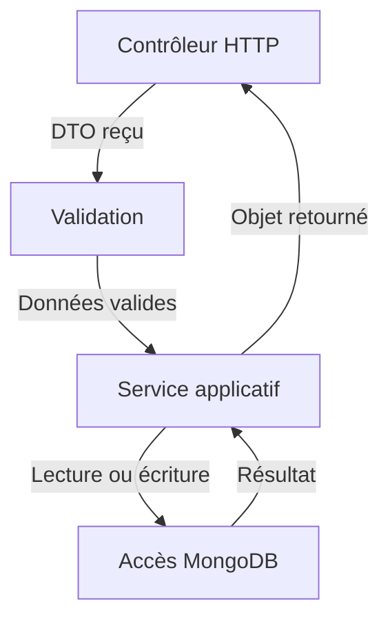
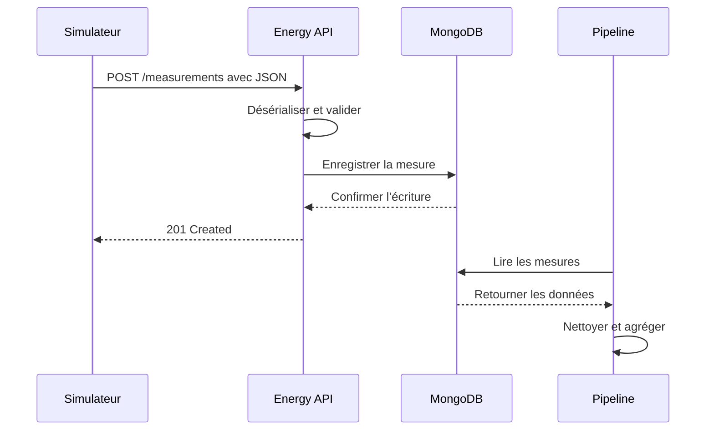

# Architecture d’Energy Platform

## Objectif

Energy Platform permet de recevoir, valider, conserver et analyser des données de consommation énergétique provenant de bâtiments.

L’architecture est divisée en composants spécialisés afin de séparer :

- l’exposition du contrat HTTP;
- la production ou l’acquisition des mesures;
- la persistance des données;
- le traitement analytique;
- l’orchestration de l’ensemble de la plateforme.

## Vue d’ensemble


Le flux principal est le suivant :

1. le simulateur produit des mesures semblables à celles de véritables capteurs;
2. `energy-api` reçoit les requêtes HTTP et vérifie leur conformité;
3. les données acceptées sont enregistrées dans MongoDB;
4. le pipeline récupère les données nécessaires aux traitements;
5. les résultats permettent de produire des indicateurs utiles à la prise de décision énergétique.

## Composants principaux

| Composant | Technologie envisagée | Responsabilité principale | Dépôt associé |
|---|---|---|---|
| API | NestJS et TypeScript | Exposer le contrat HTTP et coordonner les traitements applicatifs | `energy-api` |
| Base de données | MongoDB | Conserver les bâtiments, capteurs et mesures | Intégrée à la plateforme |
| Simulateur | Script ou service de simulation | Produire des mesures représentatives de capteurs | À préciser selon l’itération |
| Traitement analytique | Pipeline de données | Nettoyer, agréger et analyser les mesures | `energy-data-pipeline` |
| Orchestration | Configuration de plateforme | Démarrer et relier les composants | `energy-platform` |

## Energy API

`energy-api` constitue le point d’entrée HTTP de la plateforme.

Ses responsabilités sont :

- exposer des endpoints REST;
- recevoir et désérialiser les données JSON;
- valider le format et les règles applicables;
- exécuter la logique métier;
- lire et écrire les données dans MongoDB;
- produire des réponses HTTP cohérentes;
- exposer une spécification OpenAPI;
- retourner des erreurs contrôlées sans révéler de détails internes.

NestJS structure l’application autour de modules, contrôleurs, services et DTO.



### Organisation initiale

```text
src/
├── main.ts
├── app.module.ts
├── health/
│   ├── health.module.ts
│   └── health.controller.ts
└── buildings/
    ├── buildings.module.ts
    ├── buildings.controller.ts
    ├── buildings.service.ts
    └── dto/
```

L’organisation évoluera par fonctionnalité avec l’ajout de domaines comme :

- `sensors`;
- `measurements`;
- `analytics`;
- `auth`, lorsque la sécurité sera introduite.

## MongoDB

MongoDB assure la persistance des données opérationnelles.

Les principales collections envisagées sont :

| Collection | Contenu |
|---|---|
| `buildings` | bâtiments suivis par la plateforme |
| `sensors` | capteurs associés aux bâtiments |
| `measurements` | mesures horodatées envoyées par les capteurs |

Exemple conceptuel d’une mesure :

```json
{
  "sensorId": "sensor-001",
  "buildingId": "building-001",
  "measuredAt": "2026-08-27T14:30:00Z",
  "metric": "electricityConsumption",
  "value": 24.8,
  "unit": "kWh"
}
```

MongoDB ne doit pas porter à lui seul les règles du système. L’API demeure responsable de l’application du contrat et de la logique métier avant l’écriture.

## Simulateur de capteurs

Le simulateur remplace temporairement les équipements physiques.

Son rôle est de :

- générer des mesures à intervalles réguliers;
- associer chaque mesure à un bâtiment et à un capteur;
- produire des valeurs réalistes ou des scénarios contrôlés;
- envoyer les données à `energy-api` au format JSON;
- permettre de tester les erreurs, les volumes et les variations de consommation.

Le simulateur est un client de l’API. Il ne doit pas écrire directement dans MongoDB, car cette écriture contournerait la validation et les règles applicatives.

Exemple d’échange :

```http
POST /api/v1/measurements HTTP/1.1
Content-Type: application/json

{
  "sensorId": "sensor-001",
  "buildingId": "building-001",
  "measuredAt": "2026-08-27T14:30:00Z",
  "metric": "electricityConsumption",
  "value": 24.8,
  "unit": "kWh"
}
```

## Pipeline analytique

`energy-data-pipeline` transforme les données opérationnelles en informations utiles.

Ses responsabilités comprennent progressivement :

- l’extraction des mesures;
- la vérification de leur qualité;
- le nettoyage et la normalisation;
- l’agrégation par période, bâtiment ou type de mesure;
- le calcul d’indicateurs;
- la détection de valeurs anormales;
- la préparation des données destinées à la visualisation ou à une approche d’apprentissage automatique.

Le pipeline ne remplace pas l’API. Les deux composants ont des responsabilités différentes :

| `energy-api` | `energy-data-pipeline` |
|---|---|
| répond aux requêtes HTTP | traite des ensembles de données |
| exécute des opérations courtes | peut exécuter des traitements plus longs |
| applique le contrat transactionnel | produit des agrégations et indicateurs |
| sert les clients de la plateforme | alimente l’analyse et la décision |

## Orchestration

Le dépôt `energy-platform` décrit comment les composants sont utilisés ensemble.

Il pourra notamment contenir :

- la configuration des services;
- les variables d’environnement attendues;
- les dépendances entre services;
- les commandes communes de démarrage;
- les contrôles d’état;
- la documentation de déploiement.

La conteneurisation et l’orchestration détaillée seront ajoutées lorsque les composants seront suffisamment stables. Elles ne sont pas nécessaires pour décrire l’architecture logique initiale.

## Flux d’une mesure



## Principes d’architecture

### Séparation des responsabilités

Chaque composant possède un rôle principal clairement défini. Cette séparation limite le couplage et facilite les tests.

### Contrat explicite

Les échanges HTTP sont décrits par une spécification OpenAPI. Les formats, types, champs obligatoires et réponses possibles ne doivent pas dépendre d’hypothèses implicites.

### Accès contrôlé aux données

Les producteurs externes passent par l’API. On évite que le simulateur ou un autre client écrive directement dans MongoDB.

### Évolution progressive

L’architecture représente la cible du projet, mais chaque composant est introduit progressivement. Une fonctionnalité annoncée dans ce document peut donc être planifiée sans être encore implémentée.

### Configuration externe

Les adresses, ports et secrets proviennent de la configuration d’environnement. Ils ne sont pas codés directement dans l’application ni publiés dans le dépôt.

## État initial et cible

| Élément | État initial | Cible |
|---|---|---|
| API NestJS | structure et premiers endpoints | API versionnée et sécurisée |
| Données | collection en mémoire | persistance MongoDB |
| Documentation | README et architecture | spécification OpenAPI générée |
| Simulateur | scénario défini | envoi automatisé de mesures |
| Analytique | responsabilités définies | pipeline de nettoyage et d’agrégation |
| Déploiement | exécution locale | orchestration reproductible |

## Décisions à confirmer dans les prochaines itérations

- format définitif d’un identifiant;
- fréquence et volume des mesures simulées;
- modèle MongoDB et index nécessaires;
- mécanisme utilisé par le pipeline pour lire les données;
- emplacement des résultats analytiques;
- stratégie d’authentification entre les composants;
- mécanisme de traitement asynchrone si le volume le justifie;
- stratégie de déploiement.

## Mise à jour de ce document

Ce document doit évoluer avec le système. Toute modification importante de la structure, du flux de données ou des responsabilités doit entraîner :

1. la mise à jour du diagramme concerné;
2. la mise à jour du tableau des composants;
3. la vérification de la spécification OpenAPI;
4. l’ajout d’une justification dans la pull request.
